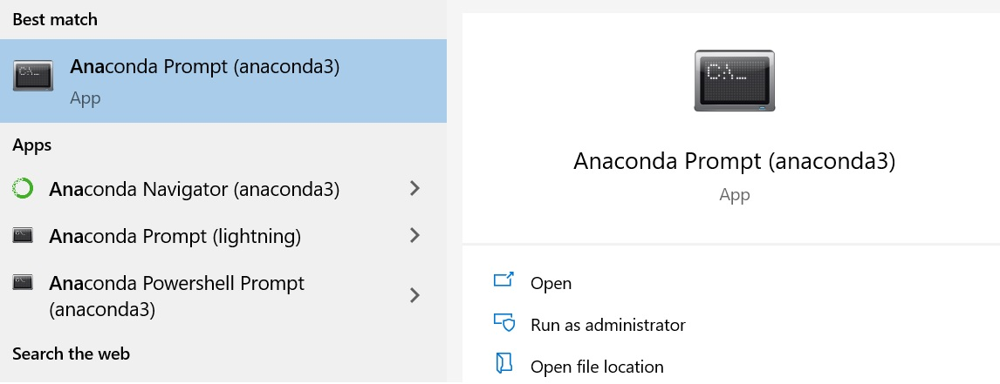
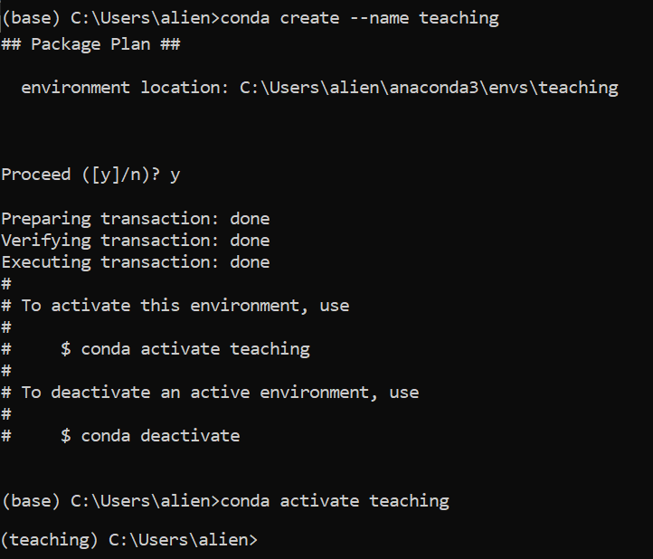

<span style="font-family: Tahoma">


##### **TL;DR**
Here is the list of operations to install a virtual environment that includes Spyder and JupyterLab from scratch.

Follow the instructions according to your Operating System (Windows, Mac, Linux OS): https://docs.anaconda.com/anaconda/install/. Don't forget to [verify your installation](https://docs.anaconda.com/anaconda/install/verify-install/) especially if you have never used the command line before. 

Open the Anaconda Prompt from your applications. 



Then type: `conda create --name myenv`

you will be asked: `proceed ([y]/n)?` press *y* and it will create the environment called "myenv".

Now to switch to your Python environment, type: `conda activate myenv`

To install Spyder: `conda install -c anaconda spyder`    
To install Jupyter:  `conda install -c conda-forge jupyterlab `  
To launch Jupyter:  `jupyter lab`  


# Quick introduction to Python
## History 
In 1989, Guido Van Rossum (a fan of the *Monthy Python's Flying Circus* TV show) created the first version of Python during one week of holidays. Until 1999 he kept developpinig it in his free time and with his colleagues. The Python language is an open-source programming language, to which anyone can contribute. The evolution of the language is supervised by a nonprofit organisation, the [Python Software Foundation](https://www.python.org/psf/), launched in 2001.
Van Rossum was still considered as the leader of the Python Project and titled [*Benevolent Dictator for Life*](https://www.urbandictionary.com/define.php?term=BDFL) until his departure in permanent vacation in 2018 following a [conflict](https://hub.packtpub.com/why-guido-van-rossum-quit/) regarding a new Python feature. 


## Python in the lab
One of the greatest advantage of Python for laboratory scientists is that it can replace you for repetitive tasks. 
A few examples: 

- Imagine you have 30 Excel sheets of similar data. You can write a code to overlap the graphs of all 30 sheets on a single graph in less time then it would take to do it manually. And next time you acquire similar data, you will have your plot in a single click.
- Imagine you want to monitor a chemical reaction by video. Annotating the 1000 frames manually would take hours. You can write a Python code to analyse the images one by one, and compute the desired results automatically. 
  
But you can go even further. It is possible to controle your instruments with Python (camera, LEDs, temperature controllers...) and that way you can launch and control your experiments remotely, even from home or from your cellphone.

To sum up, the time you invest in learning Python will be saved in all the repetitive tasks you will avoid. 

# Installing Anaconda

Installing Anaconda will install a working Python environment. Follow the instructions according to your Operating System (Windows, Mac, Linux OS): https://docs.anaconda.com/anaconda/install/. Don't forget to [verify your installation](https://docs.anaconda.com/anaconda/install/verify-install/) especially if you have never used the command line before.  

# Python packaging

You will soon become familiar with Python packages. A package is a set of features that you install and import in your code so you can use it. For example you can import a package for: 
- array computations (numpy)
- plotting (matplotlib)
- image analysis (scikit-image)
- statistics and regression (scipy, scikit-learn)
- data tables (pandas, equivalent of Excel)

Most of the time, someone has already written the code or function that you want to use. It is often much quicker to search the task you want to achieve on Google and copy it or install a package that inculdes it, than to code it yourself. 

Another interesting point: the instruments you will use in the lab require repetitive tasks of analysis, graph plotting etc. Someone has probably already written it and posted it online, so check it out first.


# Virtual environments
## Why are they necessary ?
 As Python is an open-source programming language, these packages have been developped voluntarily by different teams. As the language is in constant evolution, one has to be careful with **version mismatches**.   
 Imagine this situation: you wrote a simulation code in 2020 at the begining of your PhD. Now it's 2023 and you need to run the simulation to make a figure for your manuscript. But in the meantime you've updated Python and some pakages and your simulation doesn't work anymore. 

 Now imagine this situation: you wrote a code for image analysis in Python 3 that you use every week for your main project. This week you thought of an experiment and you want to run a simulation of a flow in a microfluidic channel. You found a package online that has several tools that can allow you to run the simulation very quickly. Problem: this package uses Python 2. You're very enthusastic about this simulation so you try to install Python 2. After a few coffee breaks, the simulation works! Now next Monday comes, and you want to use your regular image analysis code. But it doesn't work anymore because you played with your Python installation...  

 Yet another situation: you bought a new camera and you want to make a microscope picture of a slow experiment every hour for 24h. You found a Python package online that allows you to control the camera. However this package was published by a user on Github and he tested it only on his computer. His code does exactely what you want, but you get only errors when you want to use it. That is because he did not properly describe the environment (Python version, list of packages) he used to run his code, and did not provide you the means to use the code properly.  
 
 Thankfully, there is a way to avoid such situations. Good news, it is very simple ! 

 
 If want to be able to:
 - be able to run your code years after you wrote it
 - work on two different projects which don't use the same Python and packages version 
 - share your code with other users
  
You will need to get familiar with **Virtual Environments**.   
The idea is to isolate the Python environment on which your project relies. Everytime you create a new project, you create a new environment. You can fully describe this environment and transfer it to a new computer or share it with other users. 


## Creating a virtual environment

To create the said environment, open the application Anaconda Prompt:  


Then type: 

`conda create --name myenv`

you will be asked: 

`proceed ([y]/n)?`

press *y* and it will create the environment called "myenv".

Now to switch to your Python environment, type: 

`conda activate myenv`

Your environment name should appear in parenthesis in front of the path. That's how you know it is activated. Otherwise you will see (base). Be careful not to install packages on your base environment !



To exit the environment type:

`conda deactivate` 

Note: 
You will most probably be using Python 3. However if you find out that a code you want to run was written with Python 2, then you must specify the version when you create the environment (called Py2env here):

`conda create --name Py2env python=2.7`

## Anaconda packages

To install a package with Anaconda you should search it in [Anaconda Cloud](https://anaconda.org/) (no need to subscribe). Else type "anaconda install *packagename*" in Google.
The usual syntax is:

`conda install -c conda-forge packagename`

Run it in the Anaconda prompt once your environment is activated.


# Refreshing your memories

## Writing a script
To write a script you need a Python editor. Sypder is a good option, you can also use more advanced editors like [Visual Studio Code](https://code.visualstudio.com/) which also integrates LaTeX, Markdown and much more. 

If you want to use Spyder, install it in your virtual environment: 

`conda install -c anaconda spyder`

Then you can launch it from Anaconda prompt by simply typing:

`spyder`

or from your apps (select the one corresponding to your current environment).


Script example: 

```
import numpy as np
import matplotlib.pyplot as plt

x = np.linspace(0, 5, 10, endpoint = False) 
# linspace: start, stop, number of points, endpoint included or not
print(x)

x = np.linspace(0, 5, 100)

y1 = np.cos(x)
y2 = 2 * np.cos(2*x)

plt.xlabel = "time (s)"
plt.ylabel = "voltage"

plt.plot(x, y1, label = "y1", color='green',
         linestyle='solid', linewidth=2 )
plt.scatter(x, y2, label = "y2")

plt.title('Simulation')
plt.legend()

```
To run the script press F5. Click on the "Plots" pane to see the plot:   


## Using Jupyter
Jupyter is an application that offers a simple interface to work on your programmation projects. One of the most attractive feature of Jupyterare the notebooks. They are the equivalent of lab notebooks when you run lab experiments. They allow you to include text, links, images, code and code outputs inside the same document, and to export the document under a desired format (my personal favourite is export as html).

To install Jupyter:  
Make sure your environment is activated (its name is in parenthesis in the command prompt). Then type:

`conda install -c conda-forge jupyterlab `

This will install Jupyter and JupyterLab wuhich is the latest interface provided by Jupyter. 

Now launch Jupyter from the command line by simply typing:

`jupyter lab`

This page should open in your navigator: 


And you can now create a Jupyter Notebook.  

There are two modes in Jupyter: the Commmand mode and the Edit mode. Check out this [tutorial](https://medium.com/ibm-data-science-experience/back-to-basics-jupyter-notebooks-dfcdc19c54bc) to get started with Jupyer. 

Make sure to check all the Jupyter shortcuts to make your life easier !


# More advanced: 

## Pip install

If you can't find the package on Anaconda Cloud, check if it can be installed with pip (Python package installer). Type "pip install *packagename*" in Google and type in the command line:  

`pip install packagename`


## Github packages

Github is a plateform that hosts codes online. Anyone can publish its work on Github

</span>